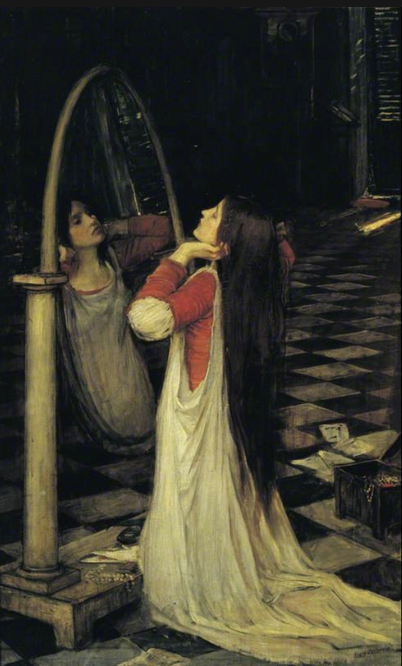
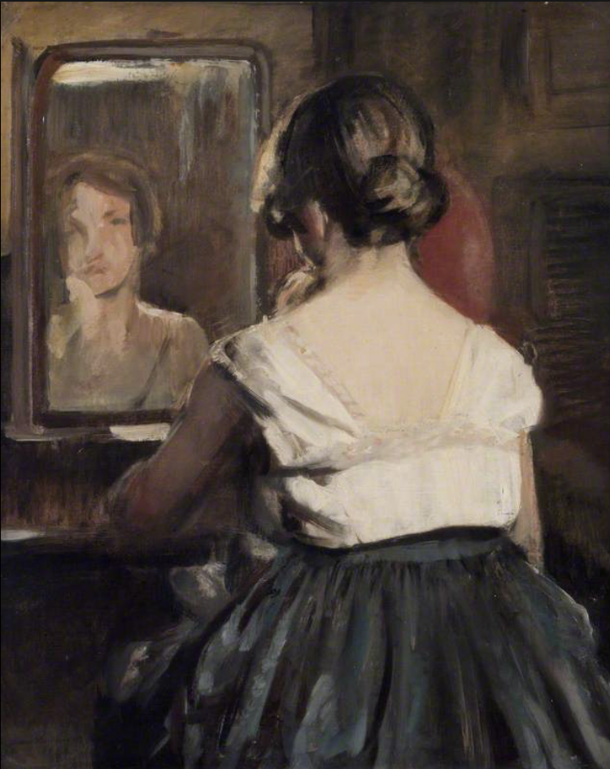
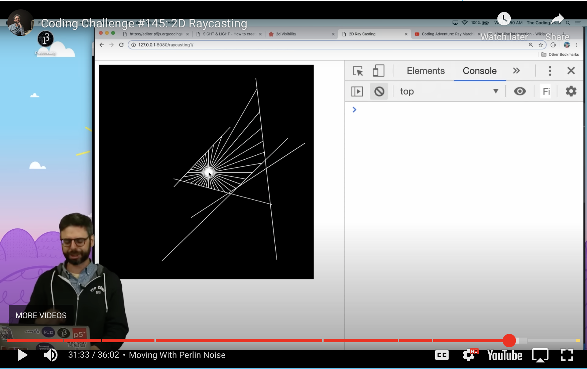

# Week-8

## Part 1
### I want to use ray casting to create a reflection off of the various "walls" of Piet Mondrian's 'Broadway Boogie Woogie' as if the walls were mirrors. Inspiration has come from a couple pieces of art showing mirrored reflections of people and/or objects. I believe this will be an interesting effect that will bring the still piece of art to life as a user interacts with it.

## Part 2 Ray Casting in 2D
### For Piet Mondrian's Broadway Boogie Woogie, I think it would be interesting to use Ray Casting in 2D to illuminate the spaces in between the rows and columns. Inspiration has come from The Coding Train's video number 145 - Ray Casting 2D.

[Example code](https://p5js.org/examples/3d-ray-casting.html)